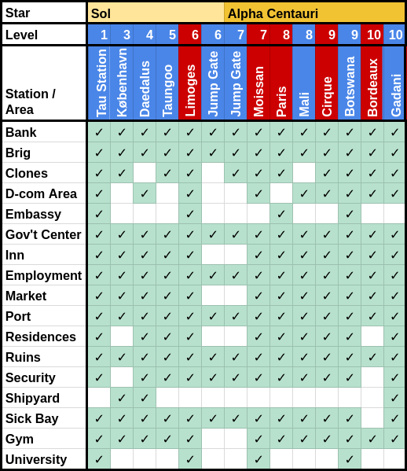

# An Introduction to Tau Station

# Table of Contents
   * [An Introduction to Tau Station](#an-introduction-to-tau-station)
      * [The Financial System](#the-financial-system)
         * [Credits](#credits)
         * [Bonds](#bonds)
         * [Banks and Your Wallet](#banks-and-your-wallet)
         * [Converting Bonds to Credits](#converting-bonds-to-credits)
      * [Stats and Focus](#stats-and-focus)
         * [Stats Regeneration](#stats-regeneration)
         * [Stats Improvement](#stats-improvement)
      * [Rations](#rations)
      * [What To Do](#what-to-do)
         * [Missions](#missions)
         * [Ruins Scavenging](#ruins-scavenging)
         * [Random Encounters in the Ruins](#random-encounters-in-the-ruins)
         * [Pursue a Career](#pursue-a-career)
            * [Choosing Your Career](#choosing-your-career)
            * [Advancing Your Career](#advancing-your-career)
         * [Side Jobs](#side-jobs)
         * [Discreet Work](#discreet-work)
            * [Discreet Work Tips and Tricks](#discreet-work-tips-and-tricks)
      * [University Courses](#university-courses)
      * [VIP Packs](#vip-packs)
      * [Travel](#travel)
      * [Player and Station Levels](#player-and-station-levels)
      * [Tiers](#tiers)
      * [Combat](#combat)
         * [Choice of Weapons](#choice-of-weapons)
         * [Weapons Maintenance](#weapons-maintenance)
      * [Clones](#clones)
      * [Shipping and Selling Items](#shipping-and-selling-items)
         * [Shipping Items](#shipping-items)
         * [Selling Items to Vendors](#selling-items-to-vendors)
         * [Selling Items on the Public Market](#selling-items-on-the-public-market)
   * [Tactics, Strategy and Advice](#tactics-strategy-and-advice)
   * [Planned Features](#planned-features)
   * [Resources](#resources)

<!-- Created by gh-md-toc, https://github.com/ekalinin/github-markdown-toc -->

[Tau Station](https://alpha.taustation.space/) is a text-based online Massive Multiplayer Role-Playing Game (MMORPG) set
in the future in space, in a post-catastrophic environment.

I (moritz) was a tester in the closed alpha testing phase, and want to document the
things I wished I knew before I started.

This document also contains corrections and contributions from Perleone,
Shadow, Dotsent and Ovid.

Note that Tau Station is under active development. Hence, parts of this
document might become outdated when the game changes.

## The Financial System

There are *credits* and *bonds*.

### Credits

Credits is everyday money that you can
earn pretty easily. With credits, you can pay for things such as hotel
rooms, public shuttles for inter-station travel, University courses, and weapons and armor. 

You can earn credits through

* successful career tasks
* selling items (for example found in the Ruins)
* daily career payments
* side jobs
* discreet work
* combat, followed by looting the opponent
* leveling up
* missions (though most missions don't pay well financially)

### Bonds

Bonds are harder to earn, and can be used to pay for things that make
playing easier or faster:

* accelerating University courses
* VIP packs
* bribing for extra rations
* premium clones
* boosting training
* faster release from the Brig (prison) and Sick Bay
* faster shuttle travel

This list is roughly sorted by utility. VIP packs and accelerated
University courses are a pretty good way to spend bonds, while I'd only
use bonds for fast shuttle travel if there was a very good reason.

You can obtain bonds in the following ways:

* you can buy them in the shop
* as a daily reward for your career level
* sometimes, discreet/anonymous work has a small bonds reward
* you can find bond packages in the Ruins
* if you level up to a new tier (if you reach levels 6, 11, 16, etc.),
  you get a bonds reward

### Banks and Your Wallet

You can have credits in your wallet and in your bank account.

From your wallet, you pay most of your everyday purchases, with
the exception of things you buy from the Public Market (which
directly withdraws from your bank account).

Credits from your wallet can be looted if somebody wins a fight against
you, and are lost if your character dies.

Bonds are always kept in the bank, but you can pay them directly without
visiting the bank.

At your home branch, withdrawing credits is free. At other branches,
the withdrawal fee is 3%, or 1% if you are VIP. You can transfer your
home branch to any Consortium station, for a fee.

Deposits are free at any bank.

### Converting Bonds to Credits

There is no way to convert credits to bonds.

The bank offers you to convert bonds to credits at a 1:1 conversion
rate, but that is a pretty terrible conversion rate.

You get a better rate if you go the vendors at the Market, and buy
a 3-day VIP pack for 290 bonds (which you can do once per 7 days).
You can sell this at the Public Market for somewhere between 15,000
and 30,000 credits (of which you need to pay 10% as market fee).
Before you do that, ask in the chat if anybody is willing to buy it, and
at what price point.

That way, you get a conversion rate of 1 bond to 45..90 credits.

If you don't have enough money to afford the seller's fee on the market,
you can try to find a potential buyer for the VIP pack in the chat, and
maybe they'll help you.

The process goes something like this:

* The two of you agree on a price for the VIP pack
* You find or buy an insignificant item like a Capacitor or Beer Bottles
* You put it up on the Public Market for 1/10th of the agreed-upon price
* The designated buyer buys the item from the Public Market

If you don't even have a 1/100th of the agreed-upon price, you might
need to conduct this process twice.

Of course, this process requires that the designated buyer trusts you
not to run away with the money before the final VIP pack sale.

## Stats and Focus

Whenever you try something, and the success is not a foregone
conclusion, you use up some of your *Focus*, and one of the five
*stats*: Strength, Agility, Stamina, Intelligence, Social.

### Stats Regeneration

Every five minutes, your Focus and stats automatically regenerate. The
rate of regeneration is higher if:

* you are currently a VIP
* you are "well fed" from consuming a ration earlier
* you are in your hotel room
* you have completed one of the "Anatomy" University courses, available
  on the Nouveau Limoges station

Regeneration might be slightly faster if you stay longer in your hotel room.

Regeneration is slower if you are confined to the Sick Bay or the Brig.

The following things immediately fill your stats and Focus:

* consuming a VIP package
* consuming a [ration](#rations) of your own [tier](#tier) or above
* leveling up

The following recovery rates have been compiled by mostly [Shadow and Dotsent](https://alpha.taustation.space/forum/discussions/topic/197-04-88-143-please-use-this-thread/post/197-53-01-501-stat-recovery):

|Booster                               | Focus/%   | Stats/% | Measured   |
|--------------------------------------|-----------|---------|------------|
| None                                 | 3         | 3       |            |
| Healthcare 3                         | 2..3      | 3       | 2018-03-27 |
| Hotel                                | 4         | 4       |            |
| Well Fed                             | 4         | 4       |            |
| Well Fed + Healthcare 3              | 5         | 5       | 2018-04-03 |
| Hotel + Well Fed                     | 5         | 4       |            |
| Hotel + Healthcare 2                 | 4         | 5       |            |
| Hotel + Well Fed + Healthcare 2      | 6..7      | 6..7    |            |
| Hotel + Healthcare 3                 | 3..5      | 3..5    | 2018-03-27 |
| Hotel + Well Fed + Healthcare 3      | 5..7      | 5..7    | 2018-04-03 |
| VIP                                  | 6         | 6       |            |
| VIP + Healthcare 2                   | 10..11    | 6..7    | 2018-03-17 |
| VIP + Hotel                          | 10..11    | 6..7    |            |
| VIP + Hotel + Healthcare 2           | 10.1      | 6.75    | 2018-03-18 |
| VIP + Hotel + Healthcare 3           | 13..14    | 9..10   | 2018-03-17 |
| VIP + Well Fed                       | 12..13    | 8       |            |
| VIP + Well Fed + Hotel               | 12..13    | 8..9    |            |
| VIP + Well Fed + Hotel + Healthcare 1| 14..15    | 9..10   |            |
| VIP + Well Fed + Hotel + Healthcare 2| 16..18    | 11      |            |
| VIP + Well Fed + Hotel + Healthcare 3| 16..18    | 12      |            |

(values without a measurement date have been assembled before 2017-03-17)

### Stats Improvement

Most stations (all except the jump gates) feature a Gym, where you can
invest focus and current stat values to train the physical stats
(*strength*, *agility*, *stamina*).

You can train *intelligence* in a similar fashion in a hotel room of an
Inn, or at a University (scroll to the very bottom of the page). Most
stations (all except the jump gates and Moissan) have an Inn, and four
stations have a University (Tau, Nouveau Limoges, Moissan, Spirit of
Botswana).

You can also train intelligence while traveling with public shuttles.

The *social* stat can be trained at the Lounge that belongs to an inn.

The efficiency of training of any of these stats depends on the station.
In general, higher-level stations yield better training benefits. For
example on Tau Station (level 1), you get about a 0.004 stats increase
for every 10% of focus that you invest. On Yards of Gadani (level 10),
the stat increase is around 0.019.

Training also depends on the character's
[genotype](https://alpha.taustation.space/archive/genotypes), because
genotypes have pre-dispositions for certain traits. Belters, for
instance, find it easier to train Agility than Strength.

Training can lead to injury (and thus unconsciousness or time at the
Sick Bay) if your stats are too low. Each gym has a minimal sum of
combined physical stats that you need to avoid injury, starting with 30
at Tau Station and going up to 39 at Bordeaux and Yards of Gadani.
Slightly higher limits (though not explicitly denoted) apply to training of the
social and the intelligence stat.

If you are repeatedly injured or becoming unconscious or detained from
training, go back to a lower-level station.

Stats can also randomly increase as a bonus of successfully completed
discreet work.

Finally, the primary and secondary stat of your career improve at midnight
GCT if you've used them on the day before.

## Rations

You can survive without explicit use of rations. But, each time you
consume a ration, it immediately fills up all of your stats and your
Focus. 

If you consume a ration of a tier one lower than your character's, the
immediate regeneration is incomplete. A ration two tiers below your
current tier does gives hardly any immediate regeneration.

Rations also give you the "well fed" status for 32 segments (roughly 8
hours), which increases stats and Focus regeneration. For rations of a
lower tier, the "well fed" status is shorter (10 segments for a tier
difference of two).

You are automatically assigned one ration per day, which you can fetch
at any station's Government Center. You can sometimes find rations in
the Ruins, and sometimes they are awarded as the random reward for doing
discreet work. Rations are also often the reward of successful combat
following random encounters in the Ruins on high-level stations.

Finally, you can spend bonds as bribes for more rations, though the
price doubles each time you do it in one day, and drops back to the
original price (20 bonds) 100 segments (one day) after your first bribe.

## What To Do

As in every RPG, there are several different things you can do, with
different resource requirements and payoffs.

### Missions

Missions are fun! You can find a mission by clicking on the "Find a
mission" link in the "Employment" box. A mission opportunity is marked
by the orange action flag, either in an area or next to a person.

During missions, you typically invest focus and some stats. After you
have finished the missions on Tau Station, you must travel to other
stations to find missions, and those missions might again prompt you to
travel to other stations, which costs you credits (and there are missions that
require at least three interstellar travels). Also, sometimes bribing
somebody with your own credits is the easiest way to convince an NPC to
collaborate.

Missions give you a small financial reward, and typically the largest
experience reward that is available in the whole game. But most
importantly, missions are interactive short stories that are enjoyable
to read and experience.

Some missions also build on other missions, and you can only engage in
the later missions if you completed the previous missions successfully.

I advise to play all missions available to you.

### Ruins Scavenging

Most stations have a *Ruins* area, where you can scavenge for discarded
treasures. Each search costs 10% stamina, and if you find something,
also 10% of focus (15% of focus if you are VIP). Each successful find
also adds to your experience.

The things you can find in the ruins include (in decreasing likelihood):

* nothing
* common trade goods (sell for less than 1 credit)
* rare trade goods (sell for 5000 credits or more)
* weapons
* armor
* bond packages
* VIP packs

You can carry around what you find, up to a certain mass limit. If you
carry around too much, you will get a warning that you are encumbered,
and lower success rates for tests against the physical stats, and moving
to a different area of the station reduces the physical stats.

If you are at 100% encumbered, you will be losing 10% of each of the
physical stats with every move to the different area of the station.
If one of your physical stats reaches 0 because of encumbrance, you will
lose consciousness and be taken to Sick Bay (or simply become unconscious),
so try to offload heavy items at the first opportunity.

If you don't want to carry around stuff, you can sell it to the vendors,
(go to Market -> Vendors and then to your Inventory), to other players
(go to Market -> Public Market and then your Inventory), or store it
(go to Market -> Storage,
buy storage if you haven't yet, and then to your Inventory), or drop them
right from the Inventory.

Common trade goods are mostly an annoyance, but some players hypothesize
that they might serve as the raw material for crafting items, when that
feature will be implemented in future.

### Random Encounters in the Ruins

In the Ruins you can also search for random encounters ("Look for trouble").
Each search costs
5% Agility and Stamina each, and 10% Focus (or 15% for VIPs). When you
find somebody, you can engage in
combat with them (but you don't have to do so immediately; you can, for
example, consume a ration or even retire to your hotel room first for
some stats replenishment).

Upon finding an opponent in the Ruins, you have 8 segments to fight them.

When you win such a fight, you can loot the opponent, which tends to give
you on the order of 1 to 100 credits, and you gain a reward. The reward
on lower-level stations is often a piece of armor or a weapon, and on
higher-level stations it can be a ration.

You also gain experience from victorious combat, more so than from career
tasks.

After finding an opponent, you cannot engage in another random encounter
for the next 8 segments. You can halve this waiting time by spending bonds.

### Pursue a Career

You can and should pursue a career. Performing career tasks is the most
reliable source of credits, and once you have been promoted a few times,
the only reliable in-game source of bonds.

#### Choosing Your Career

When I picked my career, I read through the descriptions, and picked the
one that sounded best. You should be more strategic in your choice.

The first factor you should consider is the primary and secondary stat
associated with the career tasks. You should favor a career that makes
use of Intelligence, because in the context of University courses, it
makes sense to boost that stat anyway. You should also choose a career
whose stats overlap with the strong stats of your genotype.

All else being equal, you should avoid careers whose tasks make heavy
use of stamina, so that you can use your stamina to rummage in the
Ruins.

The second factor is availability. Career tasks can be tied to locations
(you can only repair ships at a Port, and only analyze security footage
at Security), and not all stations have all areas. Ports are everywhere,
Sick Bay, Brig and Security are also nearly ubiquitous. Cloning Vats can
be found on all stations except Daedalus and the Jump Gates.

Finally, some careers are more dangerous than others; if a majority of
tasks sound illegal, you might spend quite some time in the Brig.
(Though illegal tasks tend to pay much better than comparable legal
tasks).

Note that you can abort your career at any time, and even later return
to that career with no repercussions, except of course the time you
missed advancing your career.

#### Advancing Your Career

You advance your career by succeeding at career tasks. You go to
different areas of the station, and click on the "Tasks" tab, and then
attempt some tasks. The [career overview
page](https://alpha.taustation.space/career) lists all available tasks,
and where you can try them.

Each success adds up to your career experience, and each failure
subtracts some amount.

Each night at GCT 0/0 (which coincides with midnight UTC on Auld Earth),
the number of days you spent in a career rank
increases. Once your career experience is high enough (whatever
that means) *and* you have spent enough days in the current career rank, you
are promoted. (If you fail enough tasks, you can also be demoted again).
Also at midnight you receive your regular payments of bonds and credits,
depending on your current career level.

The minimum number of career tasks increases exponentially: you can get
promoted after 2 days in career level 1, after 4 days in level 2, 8 days
in level 3 etc., all the way up to 128 days in level 7.

Career tasks use up 20% of the affected stat, and 5% focus. On success,
you get a bonus in credits (between 3 and 320, depending on the difficulty
of the task), which is the primary source of most player's
credit wealth.

As your hidden career experience increases and/or you are promoted,
more difficult career tasks become achievable. In general, you should
try career tasks where your success rate is higher than 50%. If your
success rate is higher than 80% or 90%, you might try more difficult
tasks (which are those further down the list), because they yield higher
returns.

Another factor in the success rate of career tasks is the maximum value
of the stat that is tested. Training your strength makes it easier to
lift heavy stuff, right?

### Side Jobs

Side jobs are brief, one-off jobs that pay a fixed reward. They consist
of tests against the same stat until you have passed five of them. They
pay less than career tasks, but give you much more experience.

The available side jobs and their pay depend on the station.

### Discreet Work

*Discreet Work* aka *Anonymous Missions* are automatically generated
missions that, on completion, give you a small amount of credits, and
more importantly, a random bonus. This bonus can be

* more credits
* an increase in one stat
* a weapon or armour
* a bond package
* a ration
* a VIP pack

In most cases, the potential rewards depends on the station level. For
example on Taungoo Station (level 5), the stats boost tends to be on the
order of 0.02, while you get something closer to 0.04 on Yards of Gadani
(level 10).

Completing discreet work also improves your reputation with the
affiliation of the government that controls the current station, which
in turn leads to shorter Brig times when you get caught doing something
illegal.

Some of the anonymous missions involve stealing an item from somebody,
and bringing it to somebody else. Between those two actions, the item
is in your own inventory, and you can steal it by aborting the mission.
The only repercussion is that after aborting an anonymous mission, you
won't be offered a new one for a while. For valuable items such as
rare weapons, rations, bond packages or VIP packs, this is usually worth it.

Despite the disclaimer of potential danger, Discreet Work has never
brought me into the Sick Bay or the Brig.

#### Discreet Work Tips and Tricks

* Don't try to be clever when doing Discreet Work; for example, what it
says "you must find Aearis Tinsley", you won't find her by looking through
all areas of the current station; you have to follow the mission steps.
* If you can't seem to find your next step, try going back to [the discreet work area](https://alpha.taustation.space/area/discreet-work).
* You can start discreet work while being on a mission. The link for discreet
work isn't shown while you are pursuing a mission, but if you [follow this link to discreet work](https://alpha.taustation.space/area/discreet-work), you can start it anyway.

## University Courses

University courses can teach you handy skills. You have to pay some
credits to enroll in one, and can optionally spend bonds to speed them
up. The basic courses are relatively cheap (typically around 200 credits
and fast, while more advanced courses take much longer (up to 21 days),
and can cost up to several ten thousand credits.

You can only be enrolled in one course at a time, and you cannot abort a
course that you started. Travel, Sick Bay and Brig do not affect University
courses, which just go continue in those circumstances (though may
delay the completion of a course until you are free to move again).

In the beginning, you can likely only afford basic courses, so you
should enroll in those.

One module that can be generally recommended is the collection of
Anatomy courses available on Nouveau Limoges, since it boosts stats
recovery -- something that is useful no matter what career you pursue.

Having an above-average intelligence (as shown by the stats ranking on
your character page) makes courses faster.

The following modules are available, grouped by station:

* Tau Station (Sol; Consortium)
    * Business: Bureaucracy
    * Combat: Combat Basics, Intermediate Combat, Defensive Tactics
    * Engineering: Basic Engineering
    * Spaceship Operations: Navigation, Technology
* Nouveau Limoges (Sol; Gaule)
    * Engineering: Basic Engineering
    * Medicine: First Aid, Anatomy
    * Psychology: International Relations
    * Spaceship Operations: Navigation, Technology
* Moissan Station (Alpha Centauri; Gaule)
    * Medicine: First Aid
    * Spaceship Operations: Navigation, Technology
* Spirit of Botswana (Alpha Centauri, Consortium)
    * Combat: Combat Basics, Special Ops
    * Spaceship Operations: Navigation, Technology, Ship Handling

Most courses only have negligible benefits on their own, but if you finish
several related courses, the compound effect is typically noticeable.

The *Anatomy* module consists of *Healthcare*, which speeds up stats
and focus recovery slightly, and *Self-Surgery*, which speeds up recovery
in the Sick Bay.

*Intermediate Combat* unlocks the combat belt, which allows you to carry
stims during combat (which can quickly regenerate a stat).

*International Relations* seems to make it easier to convince other people
to do things (so corresponds to an increased *Social* skill).

The *Item Repair* courses from the *Engineering* module allows you to
repair weapon and armor on your own, instead of having to pay for it.

## VIP Packs

VIP packs provide many benefits, documented
[here](https://taustation.space/blog/shop-grand-opening-next-steps/).
The most important ones are 150% Focus, much faster stats regeneration, and
larger experience gains.

Playing with an active VIP pack is significantly more fun and more
efficient. When you first use one, all your stats go to 100%, so it
makes sense to exhaust your stats through career tasks or so before you
use one.

The following are sources of VIP packs:

* You can buy them in the shop
* You can buy a 3-day VIP pack every 7 days at the Vendors (Market), for 290 bonds
* Sometimes, the random reward for discreet work can be a VIP pack
* You can buy VIP packs on the Public Market when other players are willing to part with them.
* You can find VIP packs in the ruins

You can also sell VIP packs on the Public Market, for up to 10,000 credits per day of VIP.

## Travel

You can travel from station to station within a star system through
local shuttles. If you want to travel to a station in another star
system, you first need to travel to a jump gate, from there to the other
star system's jump gate, and from there to the station you want.

Travel cost and duration depends on the distance between stations, which
varies depending on the current orbital positions.

While traveling, you can't do anything except training intelligence.
During the journey,
stats and focus slowly regenerate. So before longer journeys, it makes
sense to use up your current stats for career tasks or other purposes.

While planning your travel, be aware that hotel rooms cost more at
higher-level stations, and that shifting orbital positions can make the
return travel more expensive.

You need a Gaule visa for visiting stations under the Gaule government
(basically any station with French sounding names). As a VIP, you can
buy a Gaule visa at any station's Gov't center. Otherwise, you need to
buy it a Gaule Embassy on Tau Station (Sol) or Spirit of Botswana (Alpha
Centauri).

You can continue your career on any station that has areas where you
can perform career tasks, without any additional bureaucracy. During
travel, University courses also continue to progress.

**Station/Area Matrix**

Blue: Consortium  
Red: Gaule

## Player and Station Levels

All players start from level 1, and gain experience through

* missions
* side jobs
* successful combat
* finding things in the Ruins
* career tasks
* discreet work

When you reach 100% experience of the current career level, you ascend
to the next level. On leveling up, you receive a small bonus in credits,
and immediately regenerate all stats and Focus.
Levels are capped to 25.

Leveling up also gives you access to more missions, which have minimal
player levels as prerequisites.

Stations have levels too. You can enter stations with a higher level
than your own player level, and perform career tasks, train in the gym,
train your intelligence in the hotel room, or social in the lounge,
provided that the relevant stat is high enough. You won't be able to
start missions, do discreet work or side jobs though.

Higher-level stations generally

* have higher yields for stats training
* tend to have higher limits for safe stats training
* let you find more valuable weapons and armor in the Ruins, and as rewards for discreet work
* have more difficult opponents when you "look for trouble" in the Ruins, but
also offer higher rewards
* have more expensive hotel rooms
* have higher-paying side jobs and discreet work

All of these factors combined mean that, as long as you are not playing
missions, it usually makes sense to spend your time on higher-level stations.

## Tiers

Each block of five levels is called a *tier*, and ascending to a higher
tier (so from level 5 to 6, or from 10 to 11 etc.) gives a bonus of 500 bonds.

You cannot equip items of a tier higher than your player, so a tier 1 player
cannot equip a tier 2 or tier 3 weapon or armor. Carrying, storing and selling
items of higher tiers works fine.

The daily rations you receive at the Government Center correspond to
your own tier. Consuming rations of lower tiers gives you smaller
immediate stats refills, and shorter "Well Fed" times.

## Combat

You can attack players and some NPCs, and other players can attack you.

Combat is turn-based, though in Player-vs-player combat, there are
timeouts for the turns. In combat mode, there is also a countdown
for when Security forces will likely arrive.

When you try to attack somebody, there is a chance that Security detains
you on the spot. The chance depends on the Orwellian level of the station (which you
can find in the Government Center). Disabling the security cameras in an
area reduces the chance of getting caught.

If you are caught, the length of the stay in the
Brig depends on the law level. Tau Station is super paranoid, and you
can't ever attack somebody successfully there (with the exception
of random encounters in the Ruins).

You can wear an armour suit, and equip up to two weapons. There are three
kinds of damage, Impact, Piercing and Energy. Weapons have an inherent
accuracy, and one or sometimes two kinds of damage they make. There is also
long range and shot range combat, and gun-like weapons are suited for long
range combat, while knives and improvised weapons work in short range combat.

(A bug in the game engine lets you successfully use short-range weapons
in long-range combat, this is likely to change).

After completing the *Intermediate Combat* University courses, you also have slots
available on your belt, where you can equip stims that let you boost a stat
that is running low. But be careful, they also raise your toxin levels, and
when those reach 100%, it's off to Sick Bay.

The success of an attack depends on the physical stats (mostly Agility,
I think), the accuracy of the weapon, and combat skills (which can be
acquired through University courses).

A successful attack can damage the opponent's armor, and wound the
opponent, which reduces a physical stat. Once a physical stat drops to
zero, the loser becomes unconscious, and can be looted by the winner.

On stations with a Sick Bay, the loser can then recover in the Sick Bay.
On stations without a Sick Bay, this can be the death of the character's
body. Which hopefully triggers the activation of a clone.

You can practice combat by going to the Ruins and using the "Look for
trouble" feature.

### Choice of Weapons

You have two weapon slots that you can equip from your inventory. Since
combat typically starts from a long range, and later goes to a short range,
you should try to equip one slot with a gun-like weapon (long range), and
the other with a weapon suited for hand-to-hand combat.

If possible, you should also select the weapons to do different types of
damages, which increases your chances against an opponent with
specialized armor.

A weapon should have a high accuracy and produce much damage; so in lack
of a more sophisticated model, we use the product of accuracy and the
sum of all damages as a score for a weapon. By this score, the following
weapons can be recommended in particular:

| Tier | Weapon                 | Range | Score | Damage Type | Mass (kg) |
|------|------------------------|-------|-------|-------------|-----------|
| 1    | Rusted Butterfly Knife |Short	|1.59   | Piercing    | 0.4       |
|      |                        |       |       |             |           |
| 2    | Heated Prod            |Short	|2.36   | Energy      | 2.3       |
| 2    | Sharpened Ice Club     |Short	|2.34   | Piercing    | 1.8       |
| 2    | Old Copper Pipe        |Short	|2.32   | Energy      | 1.4       |
| 2    | Trusty Field Hand      |Long	|1.74   | Impact      | 2.8       |
| 2    | First Mate’s Input     |Long	|1.73   | Impact      | 3.3       |
|      |                        |       |       |             |           |
| 3    | Iridium Mace           |Short	|2.53   | Impact      | 2.9       |
| 3    | SAG Stun Baton         |Short	|2.35   | Energy      | 1.3       |
| 3    | Dur-Zip-Zap            |Long	|2.4    | Energy      | 0.7       |
| 3    | Handgun Reclaim        |Long	|2.36   | Energy      | 1.2       |

Be aware that you can only equip weapons and armor of your own tier or lower,
not of higher tiers.

You can obtain weapons in the following ways:

* Successful combat from random encounters in the Ruins often rewards
  you with weapons or armor.
* Sometimes Discreet Work gives you a weapon as reward.
* Some missions give you a weapon as reward.
* Discreet Work often involves stealing or finding a weapon, and delivering it
  to somebody else. You can steal the weapon you are meant to deliver.
* You can buy them at the Public Market.
* You can buy them at vendors, where the offering differs from station to
  station. The [item list on TauHead](https://www.tauhead.com/item/list) gives
  a convenient overview which weapon can be bought were.
* You can find items while scavenging in the Ruins.

### Weapons Maintenance

Weapons and armor can be damaged during fights. When the fight is over, you
can either repair it yourself if you have completed at least the basic *Item Repair* University course, or pay for repair.

You can repair your weapons everywhere, but the hotel room is the best choice.
Go to your inventory, then unequip the weapon, and then click on "repair". The
repair takes time, and consumes a bit of *Intelligence* and *Focus*. You can't
do anything else while repairing. You can spend bonds to make the repair
instantaneous.

If you want to pay for repair, you first have to go to Port -> Shipping Bay, and then
in the inventory, unequip, and then send it for repair. With this option,
you can do other things in the mean time. You will be notified when the repair
is finished. Then you can pick up the repaired item from the Shipping Bay.

## Clones

*Note: this section is a bit conjectural, because I have not yet had the
need to activate a clone.*

A clone is an insurance against the death of a character's body. You can
buy a clone at the cloning facilities that are present on nearly all
stations.

The mental model behind a clone is that it is an inactive
duplicate of the character's body, and receives all experience and
knowledge as a constant feed from the active body. Once the active body
dies, the newest clone is activated. So the character keeps its
*intelligence* and *social* stats, but reverts back to the physical
stats of the clone.

Each player has a *default clone* on Tau Station, which is automatically
updated when you level-up. Due to this mechanisms, clones are typically
only of interest when you reach the level cap at 25.

There are currently three types of clones in the game: 3D-printed, vat-grown
and *Premium*. Even though most of the stations will have Clones facility,
not all of the stations provide all three types of clones.

3D-printed and vat-grown clones can be bought with credits, with the cost 
dependent on the player's level. The main differences between them are:

* 3D-printed clones are around 50% cheaper than vat-grown
* 3D-printed clones might experience mutations while created - meaning
that their stats have a chance to get lower than the original ones. You
can, however, purchase the *Positive mutation* perk for 20 bonds that will
actually make your 3D-printed clone "better" than original you!
* 3D-printed clones always have the same genotype as original. However,
if you purchase a vat-grown clone, you can select its genotype against
an additional payment of 20 bonds.

Both vat-grown and 3D-printed clones have a fixed gestation time of 100 segments (one day),
which can be halved for 70 bonds.

*Premium* clones cost a flat rate of 99 bonds, and offer the advantage that
you can later update them to your current physical stats. You can spend 
20 bonds per clone to update them all to your current physical stats.

The gestation time of a *premium* clone is 200 segments and can be halved for
additional 99 bonds.

## Shipping and Selling Items

### Shipping Items

You can send items to other players, or to yourself on specific
stations.

To send an item to another player, you first have to add them at the
[contacts page](https://alpha.taustation.space/contact).

In either case, go the Port and then Shipping Bay, and then to your
inventory. There you can select an item, and click on *Send item*. This
lets you select the recipient, and if you select yourself, the
destination station. The shipping price depends on the distance
and the shipped object's mass.

After the object has arrived, the recipient gets a notification, and can
pick up item at the Shipping Bay. If they don't do so within 20 days,
they get a notification that they have ten days remaining, otherwise the
item will be sent back.

You can send items to yourself if you do not wish to carry them around
(for example if they are too heavy to carry them around the whole time,
or you don't want to risk losing them if your current clone dies). You
can also send items as gifts to other players.

If an item has been delivered to you to the shipping bay of a station
that you are currently not on, you can redirect the shipment to the
current station (for which you have to pay).

### Selling Items to Vendors

You can sell items for a fixed price if you go to Market and then
Vendors (and then select the Inventory). Each item has a nominal price,
and you get 30% of that price at NPC vendors. The same vendors also
sell items, but often for much more than the nominal price (like, a
factor of 9 or so above the nominal price).

### Selling Items on the Public Market

The *Public Market* allows you to sell items to other players. You can
select an item for sale, and define a price. You have to pay 10% of the
selling price up-front, which covers shipping fees as well. If a player
buys it within three days, you will receive the asking price directly to
your bank account. Otherwise, you can pick up the item after three days
at the Shipping Bay.

# Tactics, Strategy and Advice

Some random bits of advice on how to make the most of out Tau Station:

* Play the missions for fun and profit!
* Pick a career that doesn't have Stamina as primary or secondary stat (Medicine or Special Ops)
* Use your Stamina to search for valuable things in the Ruins. Despite what it says in the area descriptions, the Ruins are not (yet?) dangerous (except for other players attacking you, which can happen in other areas too).
 * Equip the best weapons and armor that you find
 * Store or sell the rest, depending on how badly you need the money
* As soon as you have reached level 3, strive to spend most of your time on higher-level stations; training your stats is more efficient there, and you find more valuable things in the ruins. 
* When you are not actively playing, spend your time in a hotel room, which speeds up stats and focus regeneration, and keeps you safe from attacks.
* Missions, Discreet Work and training your stats require more Focus than career tasks and ruins scavenging; so if you are on VIP packs occasionally, do the first-mentioned kinds of things preferably while on VIP, and focus on your career and ruins searching while not a VIP.
* The Sol Jump Gate has a mission ("The Sleepless Ship") that takes you
  to Alpha Centauri, so only engage in that mission when you are ready
  to travel to Alpha Centauri (level 7, most stats at 12 or more; and at
  least 2000 credits, since an interstellar jump costs around 1800
  credits, and then you might need to travel to another station before you
  can earn much money).
* Only bother with clones after you have put significant effort into
  training physical stats, and even then it only rarely makes sense.
* If you can, avoid illegal career tasks on Gaule-affiliated stations,
  since they punish foreigners harsher than the Consortium punishes
  their own citizens.

# Planned Features

From the [official blog](https://blog.taustation.space/blog/), twitter and statements
from the Tau Station team, it seems that at least the following major features
are planned:

* The ability to purchase *private ships*, and use them for travel.
* *Crafting* items, which makes sense if you need something to sell.
* Player *Syndicates*, cooperations of players that conduct business together.
* More star system, starting with *Barnard's Star*.
* Prerequisites and Perks for career levels.
* Modifications (*mods*), implanted electronic devices that modify attributes of the body.
* More missions and artwork.
* More careers
* Ice Mining
* New skills
* Extension to the random encounters in the Ruins.
* Multi-player cooperative Player-vs-Environment campaigns
* Music and sound effects

# Resources

* [TauHead](https://www.tauhead.com/) harvests encyclopedic data from the Tau Station universe.
* The [Taustation Archives](https://alpha.taustation.space/archive) contain information about star
systems, stations, ship types and much more.
* This [Greasemonkey Script](https://gist.github.com/moritz/97aa186cd99daee2b63c82bc9a20bb5a) adds some navigation shortcuts to the menu, and can optionally hide buttons that spend bonds to prevent accidental spending.
* The IRC channel `##taustation` on irc.freenode.org is a meeting point for players who find the built-in chat cumbersome.
* There's a Tau Station [subreddit](https://www.reddit.com/r/taustation/).
